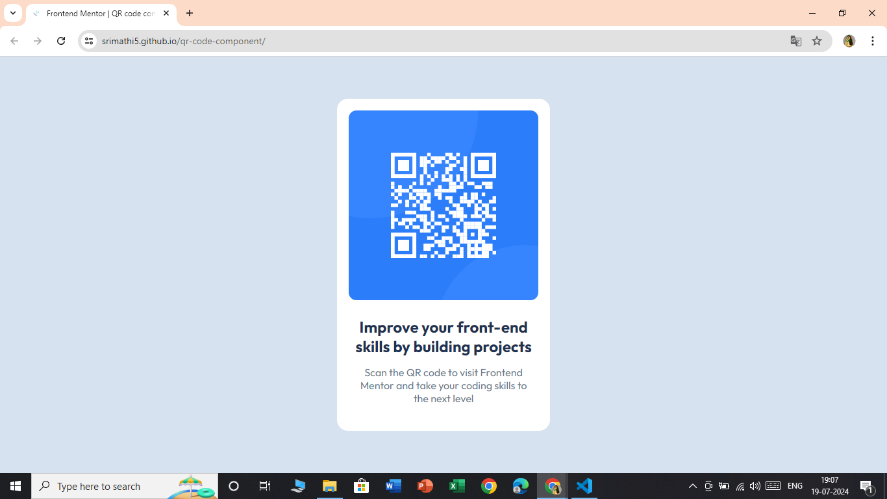

<!-- # Frontend Mentor - QR code component solution -->

This is a solution to the [QR code component challenge on Frontend Mentor](https://www.frontendmentor.io/challenges/qr-code-component-iux_sIO_H). Frontend Mentor challenges help you improve your coding skills by building realistic projects. 

## Table of contents

- [Overview](#overview)
  - [Screenshot](#screenshot)
  - [Links](#links)
- [My process](#my-process)
  - [Built with](#built-with)
  - [What I learned](#what-i-learned)
  - [Continued development](#continued-development)
  - [Useful resources](#useful-resources)
- [Author](#author)
- [Acknowledgments](#acknowledgments)

**Note: Delete this note and update the table of contents based on what sections you keep.**

## Overview
This project involves building a QR code component based on the design provided by Frontend Mentor. The challenge is to replicate the design as closely as possible using HTML and CSS. The project is intended to help developers practice and improve their front-end skills by working on a realistic, hands-on coding task.

Key aspects of the project include:
- Creating a responsive design that works well on both mobile and desktop screens.
- Using semantic HTML5 markup for better accessibility and SEO.
- Implementing custom CSS properties to achieve the desired styling.
- Practicing modern CSS layout techniques like Flexbox and Grid.
- Managing assets and ensuring that the final component matches the provided design specifications.

### Screenshot

### Links

- [Solution URL](https://github.com/Srimathi5/qr-code-component)
- [Live Site URL](https://srimathi5.github.io/qr-code-component/)

## My process
The following are the specific skills and knowledge i used during the project.

### Built with

- Semantic HTML5 markup
- CSS custom properties
- CSS Grid
- Google Fonts

### What I learned
In this project, I learned how to:
- Use semantic HTML5 elements to improve accessibility and SEO.
- Apply CSS custom properties for better maintainability and theming.
- Utilize Flexbox and CSS Grid to create responsive and flexible layouts.
To see how you can add code snippets, see below:

### Continued development
In future projects, I plan to:
- Explore more advanced CSS techniques and animations.
- Improve my understanding of responsive design principles.
- Experiment with JavaScript to add interactivity to components.
- Focus on writing cleaner, more maintainable code by following best practices and design patterns.

### Useful resources
- [MDN Web Docs](https://developer.mozilla.org/en-US/) - Comprehensive resource for web development documentation and tutorials.
- [CSS-Tricks](https://css-tricks.com/) - A great site for CSS tips, tricks, and techniques.
- [Frontend Mentor](https://www.frontendmentor.io) - The platform providing challenges to improve coding skills.

## Author
- Frontend Mentor - [@Srimathi5](https://www.frontendmentor.io/profile/Srimathi5)

## Acknowledgments
I would like to thank the following resources and individuals for their support and inspiration during this project:

- **Frontend Mentor:** For providing the challenge and a platform to improve my coding skills.
- **MDN Web Docs:** For their comprehensive and detailed documentation on HTML, CSS, and JavaScript.
- **CSS-Tricks:** For the valuable tips and tutorials on modern CSS techniques.

Thank you all for your contributions to the development community and for helping me grow as a developer.
